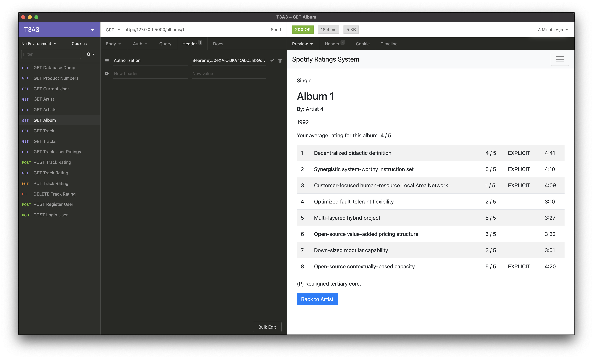
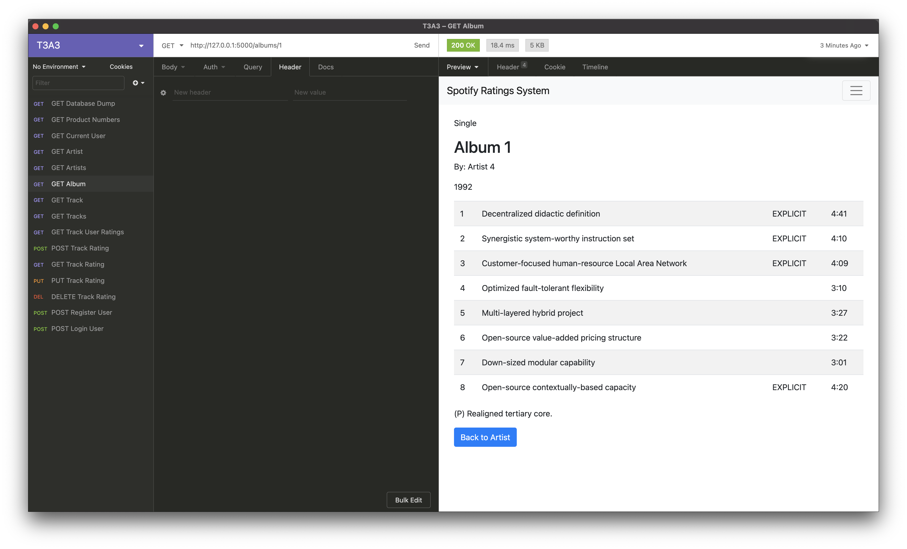

# T3A3 - Implement a System with Data and Application Layers

## About

For this assessment I have chosen to implement an Album/Track ratings system in Spotify that was explored in the previous T3A2 assessment. This is achieved primarily through the addition of a track_ratings table to the existing database. This is created as a separate table so that it allows users to rate tracks without needing to save them to their personal Spotify library. This ratings system is initially very simple to make implementation easier. It basically just provides a way for users to assign a 1-5 rating for individual tracks and then allows them to update and remove any existing ratings they have made. In regards to album ratings, those are not set by users, instead the rating for an album is calculated as the average rating of the album's tracks ignoring any tracks without ratings as it seems more appropriate to not have unrated tracks skew the average.

## Simplifications

As the main purpose of this project is to implement a working feature, a number of simplifications to the database have been made so that the focus is on the feature rather than trying to recreating Spotify's whole database.

Along with only including the database tables necessary to create this extension, the relationship between tables has also been simplified to one-to-one relationships such as between artists and tracks. The attributes for the models used to create this extension have also been simplified, such as all the primary key ids being integers rather than a uuid. Finally for authentication/authorization purposes JWT's have been used instead of Oauth tokens which are simply sent as part of the request header rather than stored as a cookie.

## Table of Contents
- [Installation](#installation)
- [Data Integrity/Validation](#data-integrity-validation)
- [User Interface](#user-interface)
- [Professional Report: Privacy and Security](#professional-report-privacy-and-security)
- [Professional Report: Developer Obligations](#professional-report-developer-obligations)

## Installation

1. Clone the repository, `git clone https://github.com/AndrewGregorovic/ccc_t3a3.git`
2. Navigate to the app directory, `cd <path/to/directory>/ccc_t3a3`
3. Install a virtual environment, `python3 -m venv venv`
    > Install the venv module if you are missing it, `pip3 install venv`
4. Activate the environment, `source venv/bin/activate`
5. Install dependencies, `pip install -r requirements.txt`
6. Create a local postgres database for the application to connect to
    > Install postgresql if you are missing it.
7. Set the environment variables using the .envexample file, the DB_URI variable is partially filled out to help with setting it correctly
8. Run the following commands to create (and seed if necessary) the database tables, `flask db upgrade'` and `flask db-custom seed`
9. Run the app, `flask run`

## Data Integrity/Validation

Data integrity and validation is achieved in this extension through the use of constraints and unit testing.

Both the models and schemas used in this application have constraints built in to validate the data being entered into the database is correct and which therefore maintains the integrity of the database by ensuring that there are no missing fields or incorrect data types in records that have been saved to the database. The model constraints include data type constraints, null constraints, primary/foreign key constraints and length constraints for strings. Certain model attributes also have set defaults to prevent errors for fields that are not nullable and it makes sense to have a default. Schemas use multiple validation methods to validate input/output from the database such as data type validation, range validation for integers and length validation for strings as well as equal or oneof validation for appropriate string inputs. The schemas also ensure that when accepting user input, all required fields are provided so that no incomplete records are given to the database.

As the front end for this application is very limited with the project focus being more on the back end, unit testing is also conducted on all the api endpoints that do not return a html page. In these unit tests the full set of model attributes that is returned from the api request is tested to validate the data that is retrieved from the database.

## User Interface

The user interface for this application is incredibly basic as the focus is on developing the backend for the extension. The only endpoints which return html pages are `get_artists`, `get_artist` and `get_album`. The page that is linked to when clicking on the Spotify Ratings System link is the Browse Artists page which simply lists all the artists in the database. Clicking on an artist will take you to the page for that artist displaying some basic information along with a list of the albums by that artist. Navigating to a specific album will display a bit of album information along with a track list and a button at the bottom to return to the artists page.

In order to see ratings for an album and individual tracks, a valid JWT needs to be sent in under the Authorization header so that the application can retrieve the ratings for that specific user. Without a JWT the ratings information will simply not appear as it makes no sense for ratings information to appear in this situation.

Album view for a logged in user

Album view for a user who isn't logged in

## Professional Report: Privacy and Security

As a software developer working on an application there are many considerations that need to be made, with one of the most significant being privacy. The privacy of confidential data is achieved through the implementation of appropriate security measures which prevent access to this data by unauthorized users. The following security measures are in place to protect the privacy of data in this application.

#### Authentication/Authorization

For this project user authentication is achieved with a simple email/password match to registered users data stored in the application's database. Once authenticated, i.e. logged in, the authorization of users is handled through Java Web Tokens.

These access tokens are created by the application whenever a user logs into the system and returned to the users web browser from the login endpoint, this is so the token can be used in either accessing restricted endpoints or providing additional functionality on public endpoints. A secret key for JWT generation is set during production and stored as an environmental variable preventing access to the key by anyone who does not have direct access to the host machine, this aids in preventing the tampering of JWT's as without the secret key it is not possible to alter existing tokens or create new tokens and have those tokens be recognised as valid by the system.

Additionally JWT's used in this project have an expiry time of 1 day, this is a form of mitigation in case an unauthorized user manages to get access to a valid JWT. While a 1 day expiry time may seem overly long from a security standpoint, for this project a shorter expiry time does not feel necessary as the only sensitive data that can be accessed by a regular user is that specific user's music library and account data.

#### Password Handling

With user authentication requiring a password, it is necessary to ensure that user passwords are appropriately secured by the application to reduce the likelihood of anauthorized users gaining access to them.

First of all, when a new user signs up to the service and has to provide a password, it is required for that password to be of a minimum length. For this project which is merely to showcase a possible extension to Spotify, the minimum length is 6 characters however for an application intended to be in a production environment it would be recommended that the minimum length is at least 8 characters. While the use of different case letters, special characters and numbers can help when creating a strong password, it is actually the password length that is the largest factor in preventing password hashes from being cracked which is why setting a minimum length helps with password security.

When passwords are received by the application, either during user sign up or log in, the password is immediately hashed so that the application does not handle passwords in clear text. For this project the Bcrypt module is used for hashing as it uses a slower process which is a benefit against any brute force attacks as it slows the attack. As passwords are hashed immediately, they are also stored in the database in hashed form to safeguard them should any unauthorized user gain access to the databse and the stored user passwords.

Finally passwords are never revealed to users, the password field for the user model schema is set to load only which means that the application will only ever read password information given to it by a user, it will never return the password for display even though it would be in hashed form.

While not implemented in this project, passwords should be additionally salted during the hashing process. Salting is simply adding an extra bit of text to the password before hashing to further reduce the chances of an unauthorized user being able to crack the hashes of any password data they may have.

#### Input Validation

User input is always a major concern when it comes to security as invalid input can cause major issues within the application. For this application the validation of user input is handled by the Marshmallow module for Flask. Marshmallow is used to create a schema for each model used within the application, this schema is what checks the validity of input data. When users send input data to the application endpoints, this data is then loaded into the application through the appropriate schema.

The schema is responsible to first check that all input fields match to a defined field in the schema and that the input contains data for all fields which are set as required. In cases where the application is adding or updating a record in the database, this prevents the application from trying to do so with a record that contains missing or invalid fields to preserve the integrity of the database.

Once the schema validates the data fields in the input, it then validates each piece of data by checking that it is of the expected data type and that it passes any other validation checks such as length checks for string data or range checks for integers. This ensures that all user input data is valid before being used within the application in order to prevent any errors that may occur from invalid inputs.

#### ORM

An object-relaional mapping tool is used in this application to avoid the use of SQL queries which improves the security of the application. For this project the SQLAlchemy module for Flask has been used as the ORM for the application.

Whenever relational SQL databases are used in an application, SQL injection attacks are a major security concern as they can cause a lot of damage to the database if not properly secured against. ORM's prevent SQL attacks by allowing the application to interact with the database through a programming language instead of raw SQL. This in combination with input validation provided by Marshmallow makes it impossible for a user interacting with the application's front end from executing SQL injection attacks as not only will the raw SQL fail input validation in a number of cases but as the the application uses the ORM to generate queries and interact with the database instead of raw SQL, the command trying to be injected simply cannot be executed.

#### Application Database

To further protect the application's database from unauthorized access it is important to have an appropriate architectural structure planned out for deployment. Assuming that the application is hosted from an organisations virtual private cloud, it is necessary to have the web servers hosting the application on a public subnet which is accessable by anyone as otherwise users would not be able to interact with the application. However this is not true for the database servers which will host the database, it is important to increase security and prevent unauthorized access that these servers are located instead on a private subnet within the organisations VPC. By doing so it prevents direct access to the database servers from any machine located outside of the organisations VPC, the only way to connect to the database servers is through other machines located inside the VPN providing an additional layer of security against outside entities.

A NAT gateway will be used to allow the database servers to make outgoing connections for updating purposes, otherwise the database servers will only accept incoming communication from the application servers in the public subnet.

## Professional Report: Developer Obligations

Throughout the development of applications, software developers have many obligations to fulfill. These obligations are sometimes required to ensure that the application conforms with any applicable laws or standards, or are otherwise expected in order to please all stakeholders.

#### Professional Obligations

Three main obligations that developers are expected to fulfill professionally when developing an application is meeting development goals, the delivery of said application and the maintenance of the application once it is put into production. As this project is simply to showcase a potential extension of the Spotify application, many of these obligations focused around developing a production application don't apply however these obligations are still worth keeping in mind should this extension be added to Spotify.

During application development, whether developers are creating an entire application or implementing a new feature to an existing application, there are many concerns that need to be kept in consideration to meet development goals. Every project has a timeframe and budget associated to it and it is the obligation of the entire development team to complete development within the given timeframe and within budget to satisfy the organisation and investors. Additionally, the development team is obligated to guarantee that the application in development will meet all the requirements outlined in the project development plan as this is what the client is paying for. Failure to meet these obligations can lead to a wide range of issues including lack of appropriate testing before delivery, lack of confidence in the product from investors or consumers and potentially even legal action when development is conducted by a 3rd party.

Delivery of the application or feature is another major consideration as pushing an application from development into production can bring with it a number of issues that weren't discovered and addressed during development. While not always possible, developers are obligated to provide the best experience possible for users and launch day of an application almost always has accompanying bumps along the road. Delivery needs to be tested for prior to launch to get approximate data for determining the load on the servers and the scale at which the application needs to be launched at. Delivery also needs to be timed appropriately not only for users to use the application but also to have the development team on hand to fix any critical bugs or issues that are encountered during launch.

Once in productions, maintenance of applications still requires developers to fulfill certain obligations to be considerate of the applications user base. A CI/CD pipeline is used to push code changes to the project repository and the web servers hosting the application. This pipeline needs adequate automated and manual testing for quality control purposes to try to ensure that the user experience isn't disrupted during any hotfixes that go live without a maintenance period. When large changes need to be made to the application such as a major version update or implementing a new feature, if the change requires downtime during which the application will be unavailable, the developers are obligated to announce this to the user base so they can be informed about what is happening. While not necessary to plan the downtime for any particular period it is obviously preferred to avoid during peak usage times. Similarly to launching an application, delivery of an update or new feature still requires developers to be on hand should any issues arise once the downtime is over.

#### Legal Obligations

There are 2 main concerns when it comes to the legal obligations when developing an extension to Spotify, data security and privacy, and laws relating to the media content Spotify provides.

Regarding data security and privacy, as the application holds sensitive data that is either confidential for users or proprietary for the organisation, developers are legally obligated to protect this data to the highest standard. Implementation of the security measures explained in the [Professional Report: Privacy and Security](#professional-report-privacy-and-security) section is required to achieve this.

Though it is not in the scope of this project, as Spotify has paid services available, it additionally saves users payment information often in the form of credit card details. This requires further security measures to comply to the PCI Data Security Standards for handling sensitive payment data. To have compliance with the PCI DSS the organisation must meet the following requirements:
1. Install and maintain a firewall configuration to protect cardholder data
2. Do not use vendor-supplied defaults for system passwords and other security parameters
3. Protect stored cardholder data
4. Encrypt transmission of cardholder data across open, public networks
5. Use and regularly update anti-virus software or programs
6. Develop and maintain secure systems and applications
7. Restrict access to cardholder data by business need-to-know
8. Assign a unique ID to each person with computer access
9. Restrict physical access to cardholder data
10. Track and monitor all access to network resources and cardholder data
11. Regularly test security systems and processes
12. Maintain a policy that addresses information security for employees and contractors

Regarding media laws, as Spotify is a music streaming service there are copyright and distribution laws that they need to adhere to before they can legally provide access to that content for users. Being a global service, these laws are numerous and vary between countries and it is imperative that developers ensure the application accurately provides or prevents access to content based on whether Spotify has obtained the rights to that content on a country by country basis to avoid being in violation of any laws. As content playback is outside the scope of this project however, this is not a concern for the application being developed.

#### Ethical Obligations

Ethical obligations of developers center around acting responsible and with professionalism, and maintaining integrity when dealing with stakeholders. Throughout the development of this application it has been a priority to ensure it is at an acceptable standard. The application has been developed to the best of the developer's abilities and over the course of development has enhanced their own professional development. The necessary functionality of this application along with the protection of data has been given priority over other all other considerations for the sake of integrity. A complete and honest report detailing the security measures in place used to protect the privacy of data has been given so as to not mislead stakeholders or misrepresent the application that has been developed.